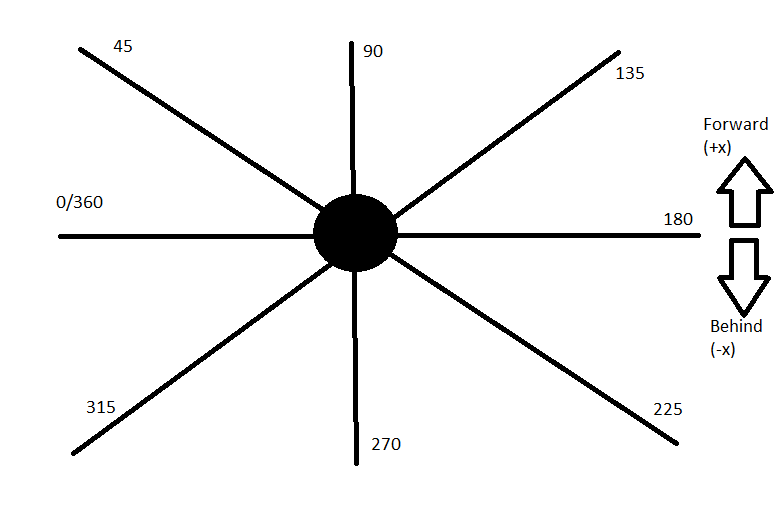

# Pickle Coding Challenge: Rationale

## Rotating base
One of the big features I decided to add was a rotating base for Gherkin, expanding its accessible space.

At default, Gherking's dual joint arm can only reach points within a 2 dimensional, circular plane. By giving the base of the arm the ability to rotate, 
we can turn that 2d plane into a 3d sphere of influence.

### Functional Logic
So, normally spherical coordinates are denoted by "the radial distance of that point from a fixed origin, 
its polar angle measured from a fixed zenith direction, 
and the azimuthal angle of its orthogonal projection on a reference plane that passes through the origin and is orthogonal to the zenith" [wikipedia](https://en.wikipedia.org/wiki/Spherical_coordinate_system) 

Unfortunately, that's not how our coordinates are represented here. And thanks to my unfamiliarity with the existing implementation of the double-jointed arm,
I was disinclined to change the measurements in the goal from planar to spherical coordinates. Instead, I added a "planar angle" to the goal coordinates.

The idea behind this is the fact that because the arm can rotate completely around the center joint, thus being able to reach behind itself, then we technically only need to concern ourselves with 180 degrees of planar angle.

Essentially, if the planar angle of the goal is 110 degrees, the arm can reach the goal if the "front" of the robot is "facing" either 110 degrees OR it's opposite angle, 290.

### Implementation
* As mentioned, I added a 3rd datapoint to the Goal object, denoting the angle of the circular plane the goal with respect to the base
* Implemented some circular angle logic for the math
  * Increasing an angle above 359 resets the value 0 + the remaining rotation
  * Decreasing an angle below 0 resets the value to 360 - the remaining rotation
  * Added access to a simple `angle.inverse`property
* Added logic to determine the most efficient direction of rotation
* Added configuration for rotation speed of the robots base
  * `FAST_ROTATION_SPEED` for larger distances
  * `FINE_ROTATION_SPEED` for more precise movement
* The robot tracks it's currently angle, and the direction determination takes that into account, so subsequent goals should "just work"
* The arm joints don't begin moving until the base reaches the correct angle
  * Both movements can probably be done independently, in parallel. Might revisit

### Visualization
Representing 3 dimensional movement is already kind of a headscratcher, and I haven't worked with `pygame` before, so I had to get creative.

I implemented a section below the core arm display that show the plane of influence as if from above the robot, the center being Gherkin and the line the reach of the arm. It's color coded to indicate "front" and back",
Green being the front and red being the back

This display rotates around the center (Gherkin) until it reaches the desired angle to reach the goal angle

### The bizarre implementation of spherical coordinates
One of the core problems with trying to use standard (x,y) coordinates in rotational space is that what positive and negative refer to are <em>relative</em>. 
In this case we have issue with the x coordinate and the implementation of the rotation. I have attempted to diagram the situation below:

As mentioned above, because Gherkin can reach in a complete circle (both "in front" and "behind" itself), we don't have to rotate the base to the specific goal
angle in order to reach the desired coordinates. We can move the shortest distance, which might be the opposite angle of the goal.

Practically speaking, this means, starting from degree 0, a goal angle of 91-180 would cause Gherkin to rotate counterclockwise to reach the opposite angle (it's faster to rotate 45 degrees counterclockwise than 135 degrees clcokwise)
, as it's a shorter distance resulting in, essentially, facing backwards.

If we accept that a negative x values means Gherkin needs to reach "behind" itself to reach the goal, this rotation presents a problem when we have a -x and a goal angle >90. 
The robot is facing "backwards" (the correct direction), but the coordinates still want it to reach behind itself, because the negativeness of the value is relative to Gherkin's facing.

Thus the hack (`main.py:32-33`): When we receive a goal that would cause us to face backwards, with a negative x value, we instead replace it with the absolute value of the coordinate,
the practical implication being that Gherkin is still facing the correct direction in regard to its goal.
